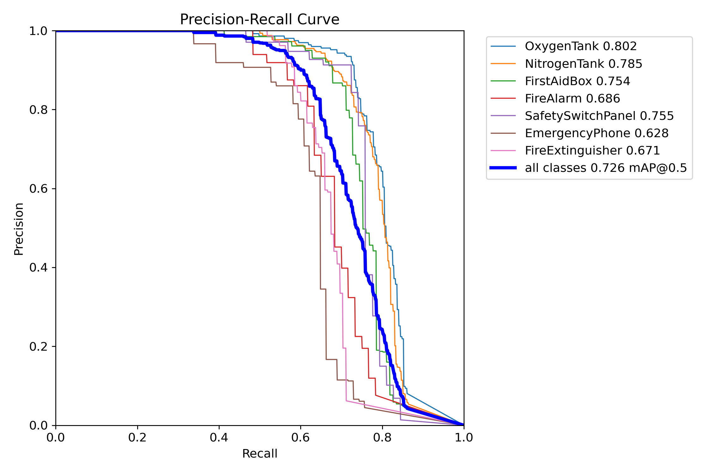
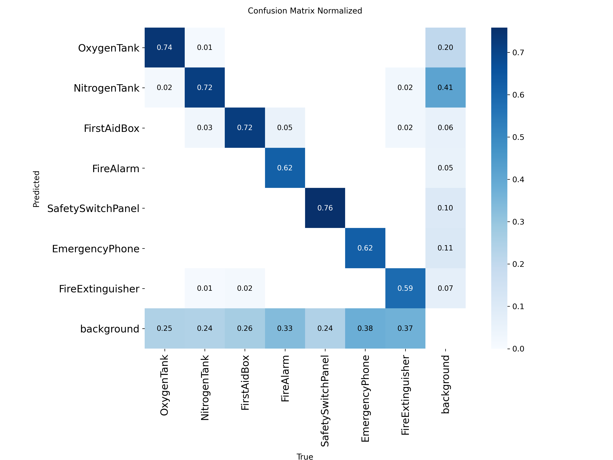
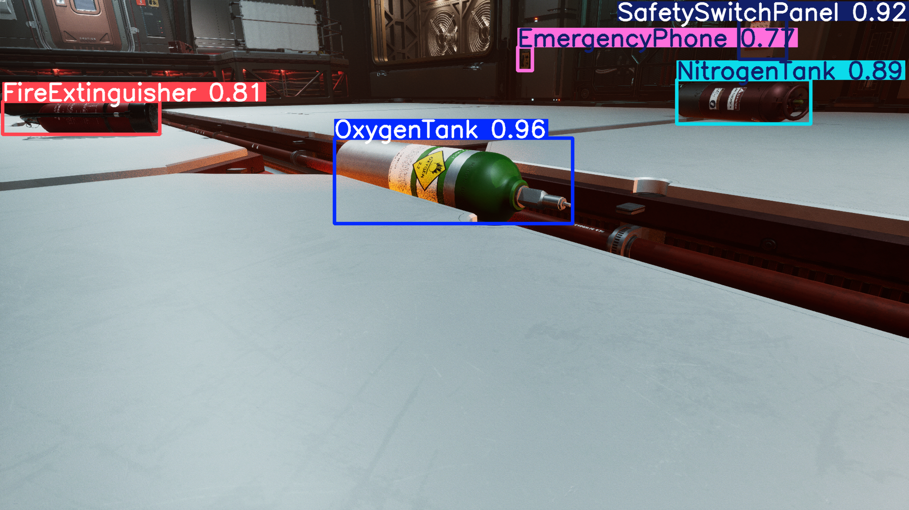
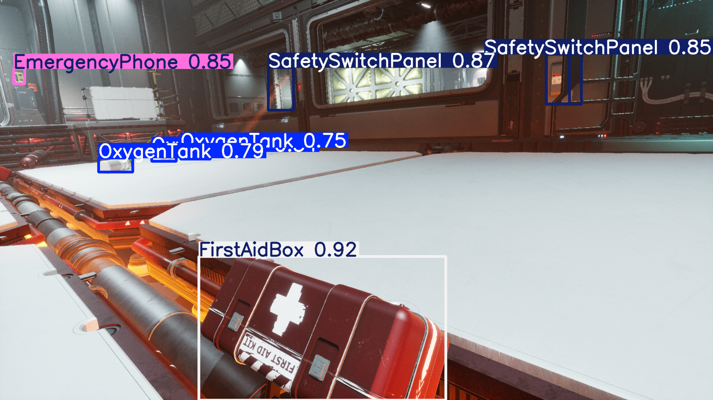

# Duality AI's Space Station Challenge: Safety Object Detection

**Team Name:** Promptify
**Final mAP@0.5 Score:** **72.6%**


---

## 📋 Table of Contents

1.  [**Project Overview**](#-project-overview)
2.  [**Key Features**](#-key-features)
3.  [**Final Results & Performance**](#-final-results--performance)
4.  [**In-Depth Model Analysis**](#-in-depth-model-analysis)
    * [Performance by Class](#performance-by-class)
    * [Failure Case Analysis](#failure-case-analysis)
5.  [**Technology Stack**](#-technology-stack)
6.  [**Setup and Installation**](#-setup-and-installation)
7.  [**Usage Instructions**](#-usage-instructions)
    * [Running Predictions](#running-predictions)
    * [Re-training the Model](#re-training-the-model)
8.  [**Use Case Application**](#bonus-use-case-application)

---

## 📝 Project Overview

This project is a submission for the Duality AI's Space Station Challenge. The core task was to train a high-performing object detection model to identify 7 critical safety items in a synthetic space station environment. Ensuring the correct identification of equipment like oxygen tanks and fire extinguishers is a mission-critical capability for ensuring operational safety and crew well-being in isolated environments like a space station.

We utilized the provided synthetic dataset of over 1500 images generated from Duality AI's Falcon platform, which included challenging scenarios with varied lighting, object occlusions, and diverse camera angles. Our approach involved using the YOLOv8s architecture, carefully monitoring the training process to achieve optimal performance, and conducting a thorough analysis of the model's strengths and weaknesses.

And additionally to further enhance the model to detect the objects in complex scenarios, we have also augumented the data in several conditions(like more image noise, less contrast, more contrast, bright vs dim image etc). 

---

## ✨ Key Features

* **High-Performance Model:** Achieved a final score of **72.6% mAP@0.5**, significantly outperforming the 40-50% baseline.
* **Robust Detection:** The model demonstrates strong performance in identifying key objects like `OxygenTank` and `SafetySwitchPanel` with high precision.
* **Detailed Error Analysis:** A comprehensive analysis of model failures, including missed detections and misclassifications, providing a clear path for future improvements.
* **Reproducible Workflow:** The project is structured with clear scripts and instructions, allowing for easy reproduction of our final results.

---

## 🏆 Final Results & Performance

Our model was evaluated on the provided test dataset. The key performance metric is Mean Average Precision at an IoU threshold of 0.5 (mAP@0.5).

**Overall mAP@0.5: 72.6%**


_The Precision-Recall curve shows the model's performance across all classes, with the overall mAP score highlighted._

### Per-Class mAP Scores

| Class                 | mAP@0.5 Score |
| --------------------- | :-----------: |
| **OxygenTank** |     0.802     |
| **NitrogenTank** |     0.785     |
| **SafetySwitchPanel** |     0.755     |
| **FirstAidBox** |     0.754     |
| **FireAlarm** |     0.686     |
| **FireExtinguisher** |     0.671     |
| **EmergencyPhone** |     0.628     |

---

## 🔬 In-Depth Model Analysis

A deeper analysis of the results reveals specific areas where the model excels and struggles.


_The normalized confusion matrix visualizes the model's per-class accuracy and its specific misclassifications._

### Performance by Class

* **Strong Performance:** The model shows high accuracy for `SafetySwitchPanel` (76%), `OxygenTank` (74%), and `NitrogenTank` (72%). These objects have distinct features that the model learned effectively.
* **Areas for Improvement:** The model had the most difficulty with `FireExtinguisher` (59%) and `EmergencyPhone` (62%). These objects may have appeared in more challenging lighting conditions or had more varied appearances in the dataset.

### Failure Case Analysis

We analyzed specific prediction errors to understand the model's limitations.

***False Negatives (Missed Detections):** The most common error was the model failing to detect an object and classifying it as background. The confusion matrix shows this was a particular issue for `EmergencyPhone` (38% missed) and `FireExtinguisher` (37% missed). This can happen in low-light conditions or when an object is heavily occluded.
    * **Example:** 
    * ![Missed Objects]
    * Here as you can see in the first image the Objects which were in the focus point have been detected with high accuracy, but as seen in the second image 2 objects(First Aid Box and a Emergency Phone) have been completely missed.
* **Misclassifications:** While less common, the model occasionally confused similar-looking objects.
    * **Example:** In Some Specific cases the `Safety Switch Panel` has been wrongly misclassified with a white wall as both carry the same color color. 
---

## 💻 Technology Stack

* **Python 3.10**
* **PyTorch**
* **Ultralytics YOLOv8**
* **OpenCV**
* **PyYAML**

---

## ⚙️ Setup and Installation
**This Model was trained on a Google Collab NoteBook rather than on Anaconda Environment, thus instructions for both the methods have been given below.**

**Google Collab** : 

1.Create a new Notebook in Google Collab, and run the below Python Script in a new Cell.
```bash
from google.colab import drive
drive.mount('/content/drive')
```
This will ensure that your drive is being used as a storage for saving, running all the scripts.

2.Now Create a new Folder in your Drive and name it according to your preference, and run the below Script in a new Cell.
```bash
# Go to your project folder
%cd /content/drive/MyDrive/Your_folder_name.
```

3. Now lets upload all the required scripts and dataset(containing train and test images, labels).

   Create the folder structure as shown below and according based on the structure 
***Note:
   use ```!cd``` and ```!cd ..``` to move in and out of folders.***
   
```
├── Duality_Hackathon/
│   ├── dataset/
│   │   ├── train/
│   │   └── val/
│   ├── runs/
│   │   └── train/
│   │       └── exp2/
│   │           ├── weights/
│   │           │   └── best.pt   <-- Our final trained model
│   │           └── ... (all result graphs)
│   ├── scripts/
│   │   ├── train.py
│   │   ├── predict.py
│   │   └── yolo_params.yaml
│   └── README.md
└── 
```

   And run the below Script in a new cell, this will open a window where you can directly upload all the necessary files directly in the file
***Note:
   The Folder in which you want to upload the specific file/script must be selected in advance using the ```cd``` command.***
   
```bash
from google.colab import files
uploaded = files.upload()
```

2.Upload all the entire scripts file consisting of train.py, Predict.py, Visualize.py(Note : Visualize.py might not work on Google Collab due to the openCV restrictions in a cloud environment, thus it is advisable that the entire visualization of predicted images is to be done in either VS Code or Anaconda Environment.

3.Since ***PyTorch*** and ***OpenCV*** are an inbuilt packages in Google Collab we dont need to install them as dependencies, But the Ultralytics and dependencies for Yolo Model need to be installed which can be done by running the below script in a new cell.
```bash
# Ultralytics will pull in PyTorch and other core libraries.
!pip install ultralytics opencv-contrib-python pyyaml
```

4.Now to last step before we train/predict using the model, We have to set the specific directory of the dataset for train and test in the ```yolo_params.yaml```

open the ```yolo_params.yaml``` file in Google Collab and add the directories for the dataset.


## 🚀 Usage Instructions


---

### Training the Model

5.To train the model we need a gpu which can be selected as runtime in collab, Select the Tensor T4 GPU (or if using Collab pro use Nvidia A100 GPU for much faster and efficient training of the model), Once the runtime has been selected run the below script in a new cell.

```bash
# If required you can change the params below based on the usecase.
!python train.py --epochs 100 --batch 8 --mosaic 0.5 --optimizer AdamW --lr0 0.001
```
### Running Predictions

To evaluate our final model and reproduce the **72.6% mAP@0.5** score, navigate to the `scripts` directory and run `predict.py`.

**Note:** Ensure the `runs` directory from our submission is located at the root of the project folder, one level above the `scripts` directory.

```bash
cd scripts
python predict.py
```

The script will output the final metrics to the console and save prediction images in the `scripts/predictions/` folder.

### Re-training the Model

The full training process can be replicated by running the `train.py` script from the `scripts` directory.

```bash
cd scripts
python train.py --epochs 100 --batch 8 --mosaic 0.5 --optimizer AdamW --lr0 0.001
```

*** All the predict/train results will be stored in a seperate folder named ```runs``` or ```train``` in the scripts folder, Additionally the train.py uses Yolo model thus when ever the script detects that the model is either overfitting or underfitting, an instance of most effective performing model is saved as ```best.pt``` in the runs\weights.

***Ananconda Enviromment***:

1.  **Clone the Repository:**
    ```bash
    git clone [your-repo-link]
    cd [your-repo-name]
    ```

2.  **Create Conda Environment:** It is recommended to use a Conda environment to manage dependencies.
    ```bash
    conda create --name duality-hackathon python=3.10 -y
    conda activate duality-hackathon
    ```

3.  **Install Dependencies:**
    ```bash
    pip install -r requirements.txt
    ```
    *(Note: You may need to create a `requirements.txt` file containing `ultralytics`, `opencv-contrib-python`, and `pyyaml`)*

---


## ✨ (Bonus) Use Case Application

**1. Application Concept:**
<p align="center">
  <figure style="display:inline-block; margin: 0 10px;">
    
    <figcaption align="center">Upload Tab</figcaption>
  </figure>
  <figure style="display:inline-block; margin: 0 10px;">
    
    <figcaption align="center">Video Tab</figcaption>
  </figure>
</p>

• As a bonus task, we have implemented a SIMS, or Safety and Inventory Management System.
• This is a proof-of-concept application designed to demonstrate a real-world use case for our trained
object detection model.
• The system addresses the critical need for automated, persistent monitoring of essential safety
equipment in a high-stakes environment like a space station, where manual checks are timeconsuming and prone to human error.
• Our prototype, built with Python and OpenCV, processes a video feed to perform real-time
detection, maintain a live on-screen inventory of all 7 safety classes, and generate intelligent alerts
for missing critical items

**2. Implementation Details:**
The application is built as a single Python script. It loads the `best.pt` model weights and uses a `while` loop to read frames from a video file. Each frame is passed to the model for inference. The results are then used to draw visualizations on the frame before it's displayed on the screen.

To run SIMS, run the below script in the terminal or in a new cell if using Google Scholar.
```
pip install ultralytics gradio
python SIMS.py
```

## Model Maintenance with Falcon:**
To keep the model up-to-date in a real-world scenario, Duality AI's Falcon platform would be essential. If a new piece of equipment is added to the space station, or existing equipment is redesigned, we could:
1.  **Update the Digital Twin:** Add or modify the 3D models of the equipment within the Falcon simulation.
2.  **Generate New Synthetic Data:** Use Falcon to generate thousands of new, perfectly labeled training images of the new/modified equipment under diverse conditions (lighting, angles, occlusions).
3.  **Fine-tune the Model:** Use this new synthetic data to quickly fine-tune our existing model, teaching it to recognize the new objects without requiring costly and time-consuming real-world data collection.

